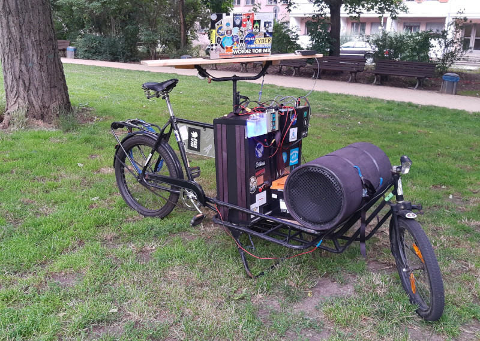

Find the Music I like on [BandCamp](https://bandcamp.com/ligi_) and [SoundCloud](https://soundcloud.com/mr-ligi/likes)

## 2020

I realized for better sound I need a bigger bike so I got a long-john from 1980. For now I just added the old system on there and just provided it with a better power supply (Liontron 80Ah@12.8V = 1024W/h = 1kWh ;)

But I need to get a scoop going on there soon.

 

## 2017

This was my first attempt. The bass roll is a magnat Power bull 300 and it is driven by a ptx500 monoblock.

 

